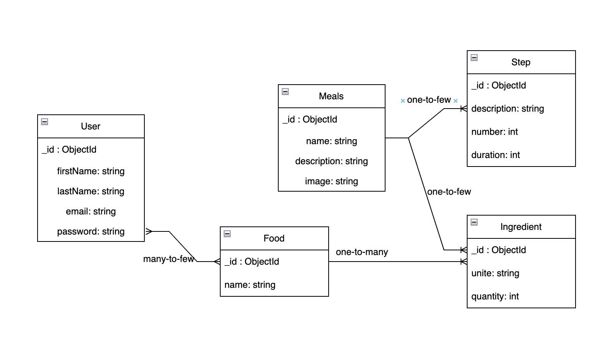

# Meal Genius API

## A propos
MealGenius est une application react native permettant de générer des idées de plats en fonction de ce que l'on a dans son frigo. L'utilisateur peut ajouter de la nourriture a son garde manger et la supprimer une fois mangée. Il peut également ajouter des plats à sa liste de favoris.
Ce projet est le backend de l'application. Il est réalisé avec Quarkus et utilise une base de données MongoDB.
L'application est un service REST qui permet de gérer les utilisateurs, les plats, les ingrédients et les recettes.

## UML

## Services
Chaque entité possède un service qui permet de gérer les opérations CRUD. 
Tous les services possèdent les opérations suivantes :
- `GET /` : Récupère tous les éléments de l'entité
- `GET /{id}` : Récupère l'élément de l'entité correspondant à l'id
- `POST /` : Crée un nouvel élément de l'entité
- `PUT /{id}` : Met à jour l'élément de l'entité correspondant à l'id
- `DELETE /{id}` : Supprime l'élément de l'entité correspondant à l'id

Certains services possèdent des opérations supplémentaires :

### Utilisateur (user)

- `POST /{id}/addfood` : Ajoute un aliment au garde manger de l'utilisateur correspondant à l'id. Si l'ingrédient donné ne possède pas d'id, l'ajoute à la base de données nourriture.

- `POST /{id}/login/{email}/{password}` : Permet de vérifier que l'email et le mot de passe correspondent à l'utilisateur selectionné.

### Plat (Meal)

- `GET /get/{name}` : Récupère le plat correspondant au nom
- `GET /search/{name}` : Récupère les plats contenant le nom voulu
- `GET /users/{id}` : Récupère les plats que l'utilisateur peut cuisiner avec ce qu'il possède
- `POST /{id}/addingredient` : Ajoute un ingrédient au plat correspondant à l'id. Si l'ingrédient ne possède pas d'ID, il est ajouté à la base de données ingrédients.

## Installation

### Prérequis
- Java 11
- Maven

### Lancement
- `mvn quarkus:dev` : Lance le serveur en mode développement

### Swagger UI
- `http://localhost:8080/swagger-ui/` : Interface graphique permettant de tester les services REST

