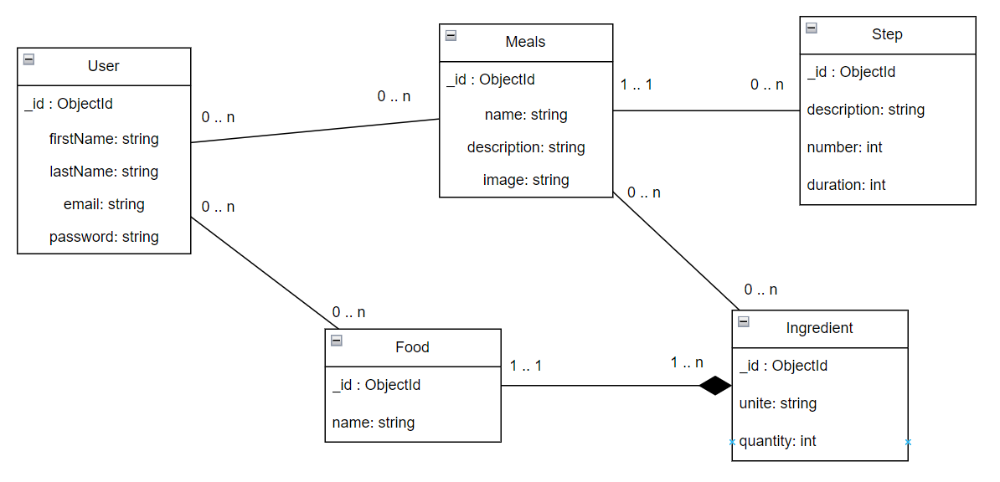

# Meal Genius API

## A propos
MealGenius est une application React Native permettant de générer des idées de plats en fonction des ingrédients disponibles dans le réfrigérateur de l'utilisateur. L'application permet à l'utilisateur d'ajouter des aliments à son garde-manger et de les supprimer une fois consommés. De plus, il peut sélectionner des plats comme favoris et les sauvegarder dans une liste dédiée. Ce projet représente la partie API de l'application, développée avec Quarkus et utilisant une base de données MongoDB. L'application fonctionne comme un service REST qui gère les utilisateurs, les plats, les ingrédients et les recettes.

## Dragramme MCD
### Shéma complet MCD

### UMl des entités implémentés

## Indexes
L'unique index est sur le champ 'name' de l'entité Food. C'est l'entité possédant le plus de recherches et c'est la seule nécessitant une facilitation et une optimisation des requêtes. C'est utile dans le cas où nous souhaitons rechercher une recette en fonction de divers ingrédients dans notre garde-manger.

## Services
Chaque entité possède un service qui permet de gérer les opérations CRUD. 
Tous les services possèdent les opérations suivantes :
- `GET /` : Récupère tous les éléments de l'entité
- `GET /{id}` : Récupère l'élément de l'entité correspondant à l'id
- `POST /` : Crée un nouvel élément de l'entité
- `PUT /{id}` : Met à jour l'élément de l'entité correspondant à l'id
- `DELETE /{id}` : Supprime l'élément de l'entité correspondant à l'id

Certains services possèdent des opérations supplémentaires :

### Utilisateur (user)

- `POST /{id}/addfood` : Ajoute un aliment au garde-manger de l'utilisateur correspondant à l'id. Si l'ingrédient donné ne possède pas d'id, il est ajouté à la base de données nourriture.

- `POST /{id}/login/{email}/{password}` : Permet de vérifier que l'email et le mot de passe correspondent à l'utilisateur selectionné.

### Plat (Meal)

- `GET /get/{name}` : Récupère le plat correspondant au nom
- `GET /search/{name}` : Récupère les plats contenant le nom voulu
- `GET /users/{id}` : Récupère les plats que l'utilisateur peut cuisiner avec ce qu'il possède
- `POST /{id}/addingredient` : Ajoute un ingrédient au plat correspondant à l'id. Si l'ingrédient ne possède pas d'ID, il est ajouté à la base de données ingrédients.

## Installation

### Prérequis
- Java 11
- Maven

### Lancement
- `mvn quarkus:dev` : Lance le serveur en mode développement

### Swagger UI
- `http://localhost:8080/swagger-ui/` : Interface graphique permettant de tester les services REST